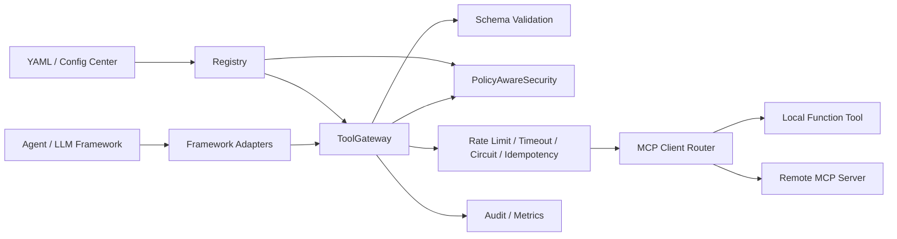

# MCP Tool Harness

MCP Tool Harness 是面向企业内部 Agent 工具接入的治理网关。轻量 Python SDK 只是接入入口，真正的核心价值是把本地函数、内部 HTTP/RPC 能力、远程 MCP Server 纳入统一的注册、策略、审批、限流、熔断、幂等、审计和可观测体系。

它适合作为：

- 企业内部 Agent 调用工具的统一入口
- 多 MCP Server、多业务域工具的注册与发现中心
- 高风险工具的策略控制、人工审批和调用审计层
- 交易、库存、营销、支付、风控等内部能力暴露给 Agent 前的治理层
- LangChain、LlamaIndex、OpenAI Agents SDK、AutoGen、CrewAI、Semantic Kernel 等框架的工具适配层

当前核心实现保持 Python 标准库优先，并提供内存实现与可替换接口。生产接入时，存储、审计、指标、限流状态可以替换为企业已有的数据库、Redis、配置中心、监控和审批系统。

## 企业级能力一览

| 能力域 | 已支持能力 | 企业价值 |
| --- | --- | --- |
| 工具注册与发现 | `server_id + tool_name + version` 唯一身份、schema hash、启停状态、TTL 本地缓存 | 避免工具 schema 静默漂移，支持多 MCP Server 下同名工具隔离 |
| 策略治理 | `ToolPolicy`、Agent allowlist/denylist、风险等级 L0-L3、高风险审批 | 模型调用意图不被默认信任，写操作和敏感操作可前置拦截 |
| 动态配置 | YAML 策略加载、MCP Server 配置加载、策略热更新到 Registry | 策略从代码中解耦，后续可对接 Nacos、Apollo、etcd 等配置源 |
| 运行时保护 | 超时、限流、熔断、幂等、schema 校验 | 防止慢工具、异常工具、重复请求和无效参数拖垮主链路 |
| 多维限流 | tenant、agent、tool、server_tool、自定义 key 模板 | 支持按租户、Agent、工具、活动、订单等维度隔离热点流量 |
| MCP 接入 | stdio、SSE、Streamable HTTP、in-memory transport、工具发现 | 统一管理本地 MCP Server 和远程 MCP Server |
| 审计与可观测 | 调用记录、JSON Lines audit sink、metrics、trace helpers、`request_id` / `trace_id` | 线上问题可回放、可追踪、可定位 |
| 框架适配 | LangChain、LlamaIndex、OpenAI Agents SDK、AutoGen、CrewAI、Semantic Kernel | 业务工具治理一次接入，多 Agent 框架复用 |
| HTTP 暴露 | FastAPI 可选服务、REST invoke、MCP JSON-RPC `/mcp` 入口 | 内部平台可通过 HTTP 或 MCP 协议统一调用 |

## 架构路径



核心调用链路：

1. 先做本地 schema 校验，非法参数不打到下游。
2. 再做限流、权限、风险和审批判断。
3. 通过超时、熔断和幂等保护真实工具调用。
4. 调用结果归一为 `ToolResult`，并写入指标与审计。

## 安装

从 GitHub 安装：

```bash
python -m pip install "git+https://github.com/zengiai/mcp-tool-harness.git"
```

从本地源码安装：

```bash
python -m pip install .
```

如果需要启动 HTTP 服务，再安装可选依赖：

```bash
python -m pip install fastapi uvicorn
```

如果希望使用完整 YAML 语法，可以额外安装 PyYAML；未安装时项目会使用内置的轻量 YAML 子集解析器：

```bash
python -m pip install pyyaml
```

## 快速开始：轻量模式

轻量模式适合本地验证、单进程工具包装和快速 demo。

```python
from mcp_tool_harness.server import ToolGateway

gateway = ToolGateway(default_rate_limit_per_minute=120, default_timeout_ms=500)


def add(left: int, right: int) -> dict[str, int]:
    return {"value": left + right}


gateway.register_tool(
    "math.add",
    add,
    description="Add two integers",
    input_schema={
        "type": "object",
        "properties": {
            "left": {"type": "integer"},
            "right": {"type": "integer"},
        },
        "required": ["left", "right"],
    },
    timeout_ms=200,
)

response = gateway.invoke(
    "math.add",
    {"left": 1, "right": 2},
    principal="agent-a",
    request_id="req-001",
)

print(response.result)
```

输出：

```python
{"value": 3}
```

## 企业级治理模式

治理模式适合把内部工具正式暴露给 Agent。它使用 `Registry` 维护工具和策略，使用 `PolicyAwareSecurity` 做权限与风险控制，使用 `PolicyAwareRateLimiter` 做多维限流，并通过 MCP client 执行真实工具。

```python
import asyncio

from mcp_tool_harness.core import (
    PolicyAwareSecurity,
    Registry,
    RiskLevel,
    ToolCallContext,
    ToolPolicy,
    ToolSpec,
)
from mcp_tool_harness.core.gateway import ToolGateway
from mcp_tool_harness.mcp import InMemoryTransport, MCPClient
from mcp_tool_harness.runtime import InMemoryIdempotencyStore, PolicyAwareRateLimiter


async def main() -> None:
    registry = Registry(cache_ttl_seconds=30)

    await registry.register_tool(
        ToolSpec(
            server_id="trade-mcp",
            name="coupon.reserve",
            description="Reserve coupon inventory before order submit",
            input_schema={
                "type": "object",
                "properties": {
                    "campaign_id": {"type": "string"},
                    "order_id": {"type": "string"},
                },
                "required": ["campaign_id", "order_id"],
            },
        ),
        policy=ToolPolicy(
            server_id="trade-mcp",
            tool_name="coupon.reserve",
            allowed_agents=frozenset({"coupon-agent", "risk-agent"}),
            risk_level=RiskLevel.L1,
            timeout_ms=300,
            rate_limits=(
                {
                    "dimension": "tenant_tool",
                    "capacity": 1000,
                    "refill_rate": 20,
                },
                {
                    "dimension": "custom",
                    "key_template": "tenant:{tenant_id}:campaign:{args.campaign_id}",
                    "capacity": 100,
                    "refill_rate": 2,
                },
            ),
        ),
    )

    transport = InMemoryTransport()
    transport.add_tool(
        "coupon.reserve",
        lambda args: {
            "campaign_id": args["campaign_id"],
            "order_id": args["order_id"],
            "reserved": True,
        },
    )

    security = PolicyAwareSecurity(registry)
    gateway = ToolGateway(
        registry=registry,
        security=security,
        limiter=PolicyAwareRateLimiter(security=security),
        idempotency_store=InMemoryIdempotencyStore(default_ttl=600),
        mcp_client=MCPClient.with_mock(transport),
        default_timeout_ms=3_000,
    )

    result = await gateway.invoke(
        "trade-mcp/coupon.reserve",
        {"campaign_id": "C-2026", "order_id": "O-1001"},
        ToolCallContext(
            request_id="req-001",
            principal="coupon-agent",
            server_id="trade-mcp",
            tool_name="coupon.reserve",
            tenant_id="tenant-a",
            trace_id="trace-001",
            idempotency_key="coupon:C-2026:O-1001",
        ),
    )

    print(result.success)
    print(result.output)


asyncio.run(main())
```

这条链路的事务边界很清晰：Harness 不做跨服务分布式事务，只负责调用前治理和调用结果归一。真正的库存预扣、优惠券核销、支付退款等写操作，仍应由下游业务服务保证本地事务、幂等与补偿。

## 动态策略配置

策略可以从 YAML 加载到 Registry。后续替换为配置中心时，只需要实现同样的 `PolicyConfigSource` 契约。

```yaml
tool_harness:
  version: trade-policy-v1
  policies:
    - server_id: trade-mcp
      tool_name: coupon.reserve
      risk_level: l1
      allowed_agents: [coupon-agent, risk-agent]
      timeout_ms: 300
      rate_limits:
        - dimension: tenant_tool
          capacity: 1000
          refill_rate: 20
        - dimension: custom
          key_template: "tenant:{tenant_id}:campaign:{args.campaign_id}"
          capacity: 100
          refill_rate: 2

    - server_id: payment-mcp
      tool_name: payment.refund
      risk_level: l2
      require_approval: true
      allowed_agents: [finance-agent]
      timeout_ms: 800
      rate_limits:
        - dimension: custom
          key_template: "tenant:{tenant_id}:order:{args.order_id}"
          capacity: 1
          refill_rate: 0.01
```

加载并应用：

```python
from mcp_tool_harness.config import YamlConfigSource
from mcp_tool_harness.core import Registry

registry = Registry(cache_ttl_seconds=0)
source = YamlConfigSource("tool-policy.yaml")

await source.apply_to(registry)
```

策略更新后再次 `apply_to()`，后续调用会使用新策略。`Registry` 默认带 TTL 本地缓存；如果希望测试或管理端立即看见变化，可以把 `cache_ttl_seconds` 设置为 `0`。

## MCP Server 托管与发现

可以在 YAML 中配置多个 MCP Server，并自动发现工具注册到 Registry。

```yaml
tool_harness:
  mcp_servers:
    - server_id: inventory-mcp
      transport: streamable_http
      url: https://inventory.example.com/mcp
      headers:
        Authorization: Bearer ${INVENTORY_TOKEN}
      timeout_ms: 1000

    - server_id: local-risk
      transport: stdio
      command: python
      args: ["-m", "risk_mcp_server"]
      cwd: /srv/risk
```

```python
from mcp_tool_harness.config import YamlConfigSource
from mcp_tool_harness.core import PolicyAwareSecurity, Registry
from mcp_tool_harness.core.gateway import ToolGateway
from mcp_tool_harness.runtime import PolicyAwareRateLimiter

registry = Registry()
source = YamlConfigSource("mcp-servers.yaml")
bootstrap = await source.discover_mcp_to(registry)

security = PolicyAwareSecurity(registry)
gateway = ToolGateway(
    registry=registry,
    security=security,
    limiter=PolicyAwareRateLimiter(security=security),
    mcp_client=bootstrap.router,
)
```

调用多 Server 下的工具时，可以使用 `server_id/tool_name`：

```python
result = await gateway.invoke(
    "inventory-mcp/inventory.query",
    {"sku_id": "SKU-1001"},
    context,
)
```

## 运行时保护策略

### Schema 校验

工具调用进入下游前会先校验 `input_schema`。参数缺失、类型不匹配会在网关内失败，不会打到业务系统。

### 多维限流

`MultiDimensionalRateLimiter` 支持多个维度同时扣减，只有所有维度都通过才会真正消耗 token，避免部分扣减导致状态不一致。

支持维度：

- `tool`
- `agent`
- `tenant`
- `agent_tool`
- `tenant_tool`
- `server_tool`
- `custom`

自定义 key 可以引用上下文和参数：

```python
{
    "dimension": "custom",
    "key_template": "tenant:{tenant_id}:order:{args.order_id}",
    "capacity": 1,
    "refill_rate": 0.01,
}
```

### 超时与熔断

`ToolPolicy.timeout_ms` 优先级高于 Gateway 默认超时。熔断器只包住下游 MCP 调用，不把本地校验、鉴权、策略失败计入下游健康状态。

### 幂等

传入 `idempotency_key` 并配置 `idempotency_store` 后，重复请求会复用已完成结果。内置存储会记录工具名、参数和调用主体的 fingerprint；如果同一个 key 被不同请求数据复用，存储层会返回 `fingerprint_mismatch`，生产接入时应按业务策略拒绝或告警。

### 审批

`risk_level >= l2` 或显式 `require_approval: true` 的工具会返回 `REQUIRE_APPROVAL` 决策。生产中可以通过 `approval_center` 接入企业审批系统；未配置审批中心时，网关默认不放行高风险工具。

## 审计与可观测

内置组件包括：

- `AsyncAuditLogger`
- `InMemoryAuditSink`
- `JsonLinesAuditSink`
- `InMemoryMetrics`
- `Tracer`

Gateway 支持注入 `audit` 和 `metrics`，调用完成后记录状态、耗时、错误码和上下文。

```python
from mcp_tool_harness.core.audit import JsonLinesAuditSink, AsyncAuditLogger
from mcp_tool_harness.observability import get_metrics

audit = AsyncAuditLogger(sinks=[JsonLinesAuditSink("logs/tool-audit.jsonl")])
metrics = get_metrics()

gateway = ToolGateway(
    registry=registry,
    security=security,
    limiter=limiter,
    mcp_client=mcp_client,
    audit=audit,
    metrics=metrics,
)
```

建议线上至少关注：

- 工具调用 QPS
- 成功率和错误率
- P95/P99 延迟
- 限流命中次数
- 熔断打开次数
- 审批拒绝次数
- 下游 MCP Server 超时次数

## 暴露 HTTP 服务

创建 `app.py`：

```python
from mcp_tool_harness.server import ToolGateway, create_app

gateway = ToolGateway()
gateway.register_tool(
    "text.echo",
    lambda text: {"text": text},
    input_schema={
        "type": "object",
        "properties": {"text": {"type": "string"}},
        "required": ["text"],
    },
)

app = create_app(gateway)
```

启动服务：

```bash
uvicorn app:app --host 127.0.0.1 --port 8000
```

查看工具列表：

```bash
curl http://127.0.0.1:8000/tools
```

HTTP 调用工具：

```bash
curl -X POST http://127.0.0.1:8000/tools/text.echo/invoke \
  -H 'Content-Type: application/json' \
  -d '{
    "arguments": {"text": "hello"},
    "principal": "agent-a",
    "request_id": "req-001"
  }'
```

## MCP JSON-RPC 调用

同一个 HTTP 服务也提供 `/mcp` 入口。

列出工具：

```bash
curl -X POST http://127.0.0.1:8000/mcp \
  -H 'Content-Type: application/json' \
  -d '{
    "jsonrpc": "2.0",
    "id": "list-001",
    "method": "tools/list"
  }'
```

调用工具：

```bash
curl -X POST http://127.0.0.1:8000/mcp \
  -H 'Content-Type: application/json' \
  -d '{
    "jsonrpc": "2.0",
    "id": "call-001",
    "method": "tools/call",
    "params": {
      "name": "text.echo",
      "arguments": {"text": "hello"},
      "principal": "agent-a"
    }
  }'
```

## 框架适配

| 框架 | 模块 |
| --- | --- |
| LangChain | `mcp_tool_harness.adapters.langchain` |
| LlamaIndex | `mcp_tool_harness.adapters.llamaindex` |
| OpenAI Agents SDK | `mcp_tool_harness.adapters.openai_agents` |
| AutoGen | `mcp_tool_harness.adapters.autogen` |
| CrewAI | `mcp_tool_harness.adapters.crewai` |
| Semantic Kernel | `mcp_tool_harness.adapters.semantic_kernel` |

OpenAI Agents SDK 示例：

```python
from mcp_tool_harness.adapters.openai_agents import (
    to_openai_agents_tool,
    to_openai_tool_schema,
)
from mcp_tool_harness.mcp.discovery import ToolSpec

spec = ToolSpec(
    name="text.echo",
    description="Echo input text",
    input_schema={
        "type": "object",
        "properties": {"text": {"type": "string"}},
        "required": ["text"],
    },
)

tool_schema = to_openai_tool_schema(spec)
tool = to_openai_agents_tool(harness_client, spec)
```

## 使用 DeepSeek 测试工具

先准备一个 gateway：

```python
from mcp_tool_harness.agent import create_deepseek_agent
from mcp_tool_harness.server import ToolGateway

gateway = ToolGateway(default_rate_limit_per_minute=120, default_timeout_ms=2_000)

gateway.register_tool(
    "math.add",
    lambda left, right: {"value": left + right},
    description="Add two integers",
    input_schema={
        "type": "object",
        "properties": {
            "left": {"type": "integer"},
            "right": {"type": "integer"},
        },
        "required": ["left", "right"],
    },
)

agent = create_deepseek_agent(
    gateway,
    base_url="https://api.deepseek.com",
    api_key="<your-api-key>",
    model="deepseek-chat",
)

result = agent.run("用工具计算 12 + 30")
print(result.content)
print([item.to_dict() for item in result.tool_invocations])
```

也可以直接使用内置 demo 工具运行命令：

```bash
export DEEPSEEK_API_KEY="<your-api-key>"
export DEEPSEEK_BASE_URL="https://api.deepseek.com"
export DEEPSEEK_MODEL="deepseek-chat"

python -m mcp_tool_harness.agent.deepseek "用工具计算 12 + 30" --show-tool-results
```

## 常见异常和状态

轻量 HTTP/SDK 入口常见异常：

| 异常 | 触发场景 |
| --- | --- |
| `ToolNotFoundError` | 工具没有注册 |
| `ToolInputValidationError` | 参数不满足 `input_schema` |
| `PermissionDeniedError` | 工具被访问策略拒绝 |
| `ApprovalRequiredError` | 工具需要审批 |
| `RateLimitExceededError` | 触发限流 |
| `CircuitOpenError` | 工具连续失败后熔断打开 |
| `IdempotencyConflictError` | 同一个幂等 key 被不同请求复用 |
| `ToolTimeoutError` | 工具执行超时 |
| `ToolExecutionError` | 工具 handler 抛出异常 |

治理网关归一状态：

| 状态 | 含义 |
| --- | --- |
| `succeeded` | 工具调用成功 |
| `failed` | 工具执行失败或下游异常 |
| `denied` | 策略拒绝或审批拒绝 |
| `pending_approval` | 等待审批 |
| `rate_limited` | 命中限流 |
| `circuit_open` | 熔断打开 |

## 生产接入边界

- 默认内存 Registry、限流器、幂等存储适合单进程和测试环境。多实例全局治理需要替换为外部一致存储或集中式服务。
- Harness 不承担业务分布式事务。写操作工具必须由下游服务保证本地事务、幂等、补偿和对账。
- 人工审批只提供接口边界和默认安全行为。生产应接入企业审批流，并把审批结果与审计关联。
- Metrics、audit、trace 组件提供基础实现。线上建议接入 Prometheus、OpenTelemetry、ELK 或企业已有监控链路。
- 对交易、库存、支付、退款等主链路工具，建议先压测限流阈值和超时策略，再开放给 Agent。
